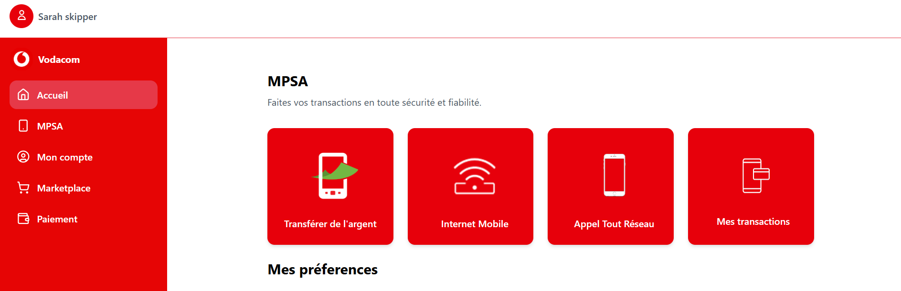
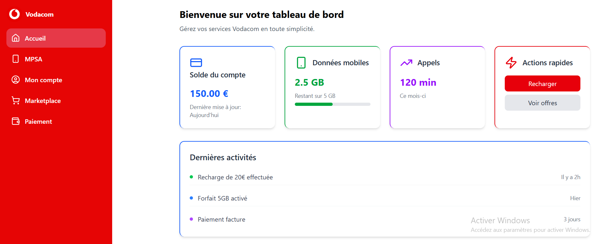

# Dashboard-Voda-Daily
# 📱 Voda Daily

Voda Daily est une application mobile **tout-en-un** inspirée des super apps télécoms (comme Orange Max it). Elle permet aux utilisateurs Vodacom de gérer facilement leurs **services télécoms**, **paiements**, et **opérations du quotidien** depuis une seule application.

---

## 🚀 Objectif du projet

L’objectif de **Voda Daily** est de simplifier la vie numérique des utilisateurs en leur offrant :

* Un accès rapide aux services Vodacom
* Une gestion claire du crédit, data et forfaits
* Des paiements mobiles sécurisés
* Une expérience utilisateur moderne et intuitive

---

## ✨ Fonctionnalités principales

### 📞 Services télécoms

* Consultation du solde (crédit & data)
* Achat de forfaits (data, appels, SMS)
* Historique de consommation
* Gestion du numéro Vodacom

### 💳 Paiement & finance

* Paiement mobile
* Transfert d’argent
* Paiement de factures (électricité, eau, TV, internet)
* Historique des transactions

### 🧾 Services du quotidien

* Achat de crédit pour soi ou pour un tiers
* Notifications et alertes
* Offres promotionnelles
* Support client intégré

---

## 🧑‍💻 Technologies utilisées

### Frontend

* React Native
* TypeScript
* Tailwind / NativeWind (UI)
* Lucide React Icons

### Backend (prévu)

* Node.js / AdonisJS
* API REST
* PostgreSQL
* Authentification JWT

---

## 🎨 Design & UX

* Interface inspirée des applications modernes (Orange Max it, MyMTN)
* Design épuré et responsive
* Couleurs principales : Rouge Vodacom, blanc , bleu
* Navigation simple et rapide

---

## 📂 Structure du projet

```
voda-daily/
├── src/
│   ├──components/
│   ├── pages/
│   ├── assets/
├── App.css
├── App.tsx
├── contact.json
├── index.css
├── main.tsx
├── .gitignore
├── eslint.config.js
├── index.html
├── package.json
└── README.md
```

---

## ⚙️ Installation

```bash
# Cloner le projet
git clone https://github.com/moskysarah/voda-daily.git

# Installer les dépendances
npm install

# Lancer l’application
npm run android
npm run ios
```

---

## 🔐 prévu la  Sécurité

* Authentification sécurisée
* Protection des données utilisateurs
* Validation côté client et serveur

---

## 📌 Statut du projet

🟡 En cours de développement

Fonctionnalités à venir :

* Scan QR pour paiement
* Dark mode
* Multi-langues
* Notifications push

---

## 🤝 Contribution

Les contributions sont les bienvenues :

* Fork le projet
* Crée une branche
* Propose une Pull Request

---

## 📄 Licence

Projet éducatif / démonstration.

---


## 📸 Aperçu du Dashboard






## 👩‍💻 Auteure

**Sarah Ngoya**
Dév
